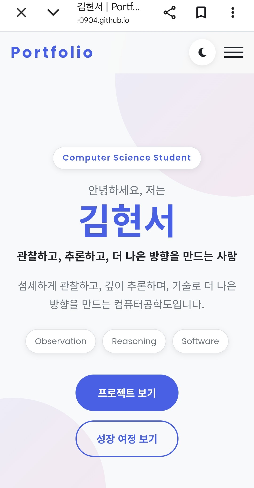

# 웹 기초 완성, 나만의 포트폴리오 구축

> 순수 HTML, CSS, JavaScript만으로 구현한 반응형 개인 포트폴리오 웹사이트입니다.  
> 보너스 기능은 제외하고, 기본 요구사항인 **시맨틱 HTML 구조, 반응형 레이아웃, DOM 이벤트 처리, GitHub API 연동, 상태별 UI 렌더링, 폼 유효성 검사**에 집중했습니다.


---

## 빠른 이동

README 전체를 링크로 복잡하게 만들기보다, 평가자가 빠르게 확인할 가능성이 높은 핵심 구간만 바로 이동할 수 있도록 정리했습니다.

| 구분 | 바로가기 |
|---|---|
| 프로젝트 개요 | [1. Project Overview](#1-project-overview) |
| 사용 기술 | [3. Tech Stack](#3-tech-stack) |
| 프로젝트 구조 | [4. Project Structure](#4-project-structure) |
| 요구사항 체크리스트 | [6. 수행 항목 체크리스트](#6-수행-항목-체크리스트) |
| 주요 기능 설명 | [8. 주요 기능 설명](#8-주요-기능-설명) |
| 상태 관리 패턴 | [9. 상태 관리 패턴](#9-상태-관리-패턴) |
| 평가용 핵심 설명 | [15. 평가용 핵심 설명](#15-평가용-핵심-설명) |
| 평가 예상 답변 | [17. 참고할 만한 평가 답변](#17-참고할-만한-평가-답변) |

---

## 1. Project Overview

이 프로젝트는 웹 개발의 기초인 **HTML, CSS, JavaScript**를 사용하여 개인 포트폴리오 웹사이트를 만드는 과제입니다.

단순히 정적인 화면을 구성하는 것이 아니라, 사용자의 클릭, 스크롤, 입력, API 응답에 따라 화면이 바뀌는 흐름을 직접 구현했습니다.

핵심 흐름은 다음과 같습니다.

```text
사용자 이벤트 발생
→ JavaScript가 상태 변경
→ DOM 클래스/내용 업데이트
→ CSS가 상태에 맞게 화면 렌더링
```

이 흐름은 React를 배우기 전 반드시 이해해야 하는 **상태 기반 렌더링의 기초**라고 볼 수 있습니다.

---

## 2. Demo

| 구분 | 링크 |
|---|---|
| GitHub Repository | https://github.com/RIIZE0904/codyssey |
| GitHub Pages URL | https://riize0904.github.io/codyssey/ |

---

## 3. Tech Stack

| 구분 | 사용 기술 | 설명 |
|---|---|---|
| Markup | HTML5 | 시맨틱 태그 기반 페이지 구조 작성 |
| Styling | CSS3 | CSS 변수, Flexbox, Grid, 반응형, transition |
| Interaction | JavaScript ES6+ | DOM 조작, 이벤트 처리, 비동기 API 호출 |
| API | GitHub REST API | 저장소 목록을 Projects 섹션에 동적 렌더링 |
| Storage | localStorage | 다크 모드 설정 유지 |
| Icons | Font Awesome | 버튼, 카드, 링크 아이콘 |
| Fonts | Google Fonts | Noto Sans KR, Poppins |

---

## 4. Project Structure

```text
.
├── index.html          # 메인 페이지 구조
├── css/
│   └── style.css       # 전체 스타일, 반응형, 다크 모드, 애니메이션
├── js/
│   └── main.js         # 이벤트 처리, DOM 조작, GitHub API, 폼 검증
└── images/
    └── profile.png     # 프로필 이미지
```

### 파일별 역할

| 파일 | 역할 |
|---|---|
| `index.html` | Header, Hero, About, Journey, Skills, Projects, Contact, Footer 구조 작성 |
| `css/style.css` | CSS 변수, 레이아웃, 반응형, 다크 모드, hover 효과, 애니메이션 작성 |
| `js/main.js` | 사용자 이벤트 처리, 상태 변경, DOM 업데이트, API 호출, 폼 검증 처리 |
| `images/profile.png` | About 섹션 프로필 이미지 |

---

## 5. 주요 섹션 구성

| 섹션 | 구현 내용 |
|---|---|
| Header | 고정 네비게이션, 섹션 이동 링크, 다크 모드 버튼, 햄버거 메뉴 |
| Hero | 인사말, 이름, 역할, CTA 버튼 |
| About | 자기소개, 강점 카드(관찰/추론/구현), 프로필 이미지, 연락 정보 |
| Journey | 성장 과정 타임라인 |
| Skills | 기술 스택 카드 목록 |
| Projects | GitHub API로 불러온 저장소 카드 |
| Contact | 이름, 이메일, 메시지 입력 폼 |
| Footer | 저작권, GitHub/이메일 링크 |

---

## 6. 수행 항목 체크리스트

### 6-1. HTML 구조

- [x] 시맨틱 태그 사용
  - `header`, `nav`, `main`, `section`, `article`, `footer`
- [x] Hero, About, Journey, Skills, Projects, Contact, Footer 섹션 구성
- [x] 네비게이션 내 각 섹션 이동 앵커 링크 구현
- [x] 이미지에 의미 있는 `alt` 속성 작성
- [x] 폼 요소에 `label` 연결
  - `for`와 `id` 매칭

### 6-2. CSS 스타일링

- [x] 외부 스타일시트 `css/style.css` 사용
- [x] CSS 변수(`:root`)로 색상, 폰트, 그림자, transition 관리
- [x] 다크 모드용 CSS 변수 분리
  - 현재 구현: `[data-theme="dark"]` (html 요소의 data-theme 속성으로 제어)
- [x] 네비게이션에 Flexbox 사용
- [x] Skills, Projects 카드에 Grid 사용
- [x] 반응형 디자인 구현
  - 768px 이하: 햄버거 메뉴, About 세로 배치, 카드 1~2열
  - 1024px 이상: About 2열, Journey 날짜·내용 좌우 배치
- [x] 버튼과 카드에 hover 효과 및 transition 적용
- [x] 카드에 box-shadow 적용
- [x] 스크롤 애니메이션 스타일 구현

### 6-3. JavaScript 기초 및 인터랙션

- [x] `var` 대신 `const`, `let` 사용
- [x] 인라인 `onclick` 대신 `addEventListener` 사용
- [x] `classList.add/remove/toggle`로 클래스 조작
- [x] 다크 모드 토글 구현
- [x] 햄버거 메뉴 토글 구현
- [x] 네비게이션 링크 클릭 시 모바일 메뉴 자동 닫힘
- [x] 스크롤 60px 이상에서 네비게이션 스타일 변경
- [x] 스크롤 300px 이상에서 스크롤 탑 버튼 표시
- [x] 스크롤 탑 버튼 클릭 시 부드럽게 맨 위로 이동
- [x] Intersection Observer로 스크롤 애니메이션 구현
- [x] 프로필 이미지 로드 실패 시 플레이스홀더 표시

> 현재 구현은 `<head>`에서 `defer` 속성으로 연결하여 HTML 파싱이 완료된 뒤 JavaScript가 실행되도록 했습니다.

```html
<script src="js/main.js" defer></script>
```

### 6-4. 폼 UX

- [x] Contact 문의 폼 구성
- [x] `submit` 이벤트 처리
- [x] `event.preventDefault()`로 기본 제출 동작 차단
- [x] 이름, 이메일, 메시지 필수값 검사
- [x] 이메일 형식 검사
- [x] 입력 필드 근처 에러 메시지 표시
- [x] 입력 중 에러 메시지 초기화
- [x] 유효성 검사 통과 시 성공 메시지 표시
- [x] 성공 메시지 3초 후 자동 숨김

> 실제 이메일 전송은 요구사항에 포함되지 않습니다. 폼 유효성 검사와 성공/에러 UI 표시가 과제 범위이며, 현재 구현이 이를 충족합니다.

### 6-5. API 연동 및 상태 관리

- [x] GitHub API 호출
- [x] `fetch`, `async/await` 사용
- [x] `try/catch`로 비동기 에러 처리
- [x] `response.ok`로 HTTP 응답 상태 확인
- [x] `response.json()`으로 JSON 변환
- [x] `filter`로 fork 저장소 제외
- [x] `map`으로 저장소 데이터를 카드 HTML로 변환
- [x] `join`으로 HTML 문자열 결합
- [x] `innerHTML`로 Projects 영역에 렌더링
- [x] 로딩 상태 UI
- [x] 성공 상태 UI
- [x] 에러 상태 UI
- [x] 빈 상태 UI
- [x] 재시도 버튼 구현

[맨 위로 이동](#웹-기초-완성-나만의-포트폴리오-구축)

---

## 7. Custom Settings

| 항목 | 기준값 | 구현 위치 |
|---|---:|---|
| 네비게이션 스타일 변경 | 60px 이상 스크롤 | `main.js` scroll 이벤트 |
| 스크롤 탑 버튼 표시 | 300px 이상 스크롤 | `main.js` scroll 이벤트 |
| Intersection Observer 임계값 | 0.2 | `main.js` IntersectionObserver |
| GitHub API 요청 개수 | 최대 12개 | `per_page=12` |
| 성공 메시지 유지 시간 | 3초 | `setTimeout(..., 3000)` |

---

## 8. 주요 기능 설명


### 기능별 바로가기

| 기능 | 설명 위치 |
|---|---|
| 다크 모드 | [8-1. 다크 모드](#8-1-다크-모드) |
| 햄버거 메뉴 | [8-2. 햄버거 메뉴](#8-2-햄버거-메뉴) |
| 스크롤 이벤트 | [8-3. 스크롤 이벤트](#8-3-스크롤-이벤트) |
| 스크롤 애니메이션 | [8-4. 스크롤 애니메이션](#8-4-스크롤-애니메이션) |
| GitHub API 연동 | [8-5. GitHub API 연동](#8-5-github-api-연동) |
| 폼 유효성 검사 | [8-6. 폼 유효성 검사](#8-6-폼-유효성-검사) |


## 8-1. 다크 모드

다크 모드는 `currentTheme` 상태값과 `localStorage`를 이용해 구현했습니다.

```text
페이지 로드
→ localStorage에서 theme 값 확인
→ currentTheme 상태 결정
→ applyTheme() 실행
→ html[data-theme] 속성 변경
→ CSS 변수 변경
```

버튼을 클릭하면 다음 흐름으로 동작합니다.

```text
다크 모드 버튼 클릭
→ currentTheme 값 반전 (dark ↔ light)
→ localStorage에 저장
→ applyTheme() 실행
→ 아이콘 변경
→ 화면 테마 변경
```

### 사용 개념

- `localStorage.getItem`
- `localStorage.setItem`
- string 상태값 (`'dark'` / `'light'`)
- `setAttribute('data-theme', currentTheme)`
- CSS `[data-theme="dark"]` 변수
- 아이콘 클래스 변경

---

## 8-2. 햄버거 메뉴

모바일 환경에서는 메뉴를 항상 보여주면 화면이 좁아지기 때문에 햄버거 버튼을 사용했습니다.

```text
햄버거 버튼 클릭
→ hamburger에 active 클래스 토글
→ navMenu에 active 클래스 토글
→ CSS transform 변경
→ 메뉴 열림/닫힘
```

### 사용 개념

- `click` 이벤트
- `addEventListener`
- `classList.toggle`
- CSS `transform`
- CSS `transition`

---

## 8-3. 스크롤 이벤트

스크롤 위치에 따라 네비게이션 스타일과 스크롤 탑 버튼 표시 여부를 변경했습니다.

```text
사용자가 스크롤
→ scroll 이벤트 발생
→ window.scrollY 확인
→ 60px 이상이면 header.scrolled 적용
→ 300px 이상이면 scroll-top 버튼 표시
```

### 사용 개념

- `window.addEventListener('scroll', ...)`
- `window.scrollY`
- `classList.toggle`
- `window.scrollTo`

---

## 8-4. 스크롤 애니메이션

Intersection Observer를 사용해 요소가 화면에 들어왔을 때 애니메이션이 실행되도록 했습니다.

```text
animate-on-scroll 요소 감시
→ 요소가 화면에 20% 이상 들어옴
→ visible 클래스 추가
→ CSS transition 실행
→ 한 번 실행 후 감시 해제
```

### 사용 개념

- `IntersectionObserver`
- `entry.isIntersecting`
- `threshold: 0.2`
- `classList.add('visible')`
- `unobserve`

---

## 8-5. GitHub API 연동

Projects 섹션은 GitHub API에서 저장소 목록을 받아와 동적으로 렌더링합니다.

### API Endpoint

```text
https://api.github.com/users/RIIZE0904/repos?sort=updated&per_page=12
```

### 처리 흐름

```text
fetchProjects() 실행
→ showStatus('loading')
→ GitHub API 요청
→ response.ok 확인
→ JSON 데이터 변환
→ fork 저장소 제외
→ 저장소가 없으면 empty 상태
→ 저장소가 있으면 카드 HTML 생성
→ Projects 영역에 렌더링
→ showStatus('success')
→ 오류 발생 시 showStatus('error')
```

### 상태별 UI

| 상태 | 표시 내용 |
|---|---|
| loading | 스피너와 "프로젝트를 불러오는 중..." |
| success | 프로젝트 카드 리스트 |
| error | "프로젝트를 불러올 수 없습니다." + 다시 시도 버튼 |
| empty | "표시할 프로젝트가 없습니다." |

### 배열 메서드 사용

| 메서드 | 사용 목적 |
|---|---|
| `filter` | fork 저장소 제외 |
| `map` | 저장소 데이터를 카드 HTML로 변환 |
| `join` | 카드 HTML 배열을 하나의 문자열로 결합 |
| `forEach` | 여러 요소에 이벤트 연결 |

### XSS 방지

외부 API에서 받은 데이터를 innerHTML에 삽입할 때는 `escapeHtml()` 함수로 특수문자를 이스케이프 처리했습니다.

```js
const escapeHtml = (value) => String(value)
  .replaceAll('&', '&amp;')
  .replaceAll('<', '&lt;')
  .replaceAll('>', '&gt;')
  .replaceAll('"', '&quot;')
  .replaceAll("'", '&#039;');
```

---

## 8-6. 폼 유효성 검사

Contact 폼에서는 이름, 이메일, 메시지를 검사합니다.

```text
폼 제출
→ submit 이벤트 발생
→ preventDefault로 기본 제출 차단
→ 입력값 가져오기
→ trim으로 앞뒤 공백 제거
→ 필수값 검사
→ 이메일 형식 검사
→ 오류가 있으면 에러 메시지 표시
→ 오류가 없으면 성공 메시지 표시 후 3초 뒤 숨김
```

### 검증 항목

| 필드 | 검증 내용 |
|---|---|
| 이름 | 빈 값 여부 |
| 이메일 | 빈 값 여부, 이메일 형식 |
| 메시지 | 빈 값 여부 |

[맨 위로 이동](#웹-기초-완성-나만의-포트폴리오-구축)

---

## 9. 상태 관리 패턴

이 프로젝트에서 가장 중요한 개념은 상태에 따라 화면이 달라진다는 점입니다.

| 기능 | 상태 | 렌더링 변화 |
|---|---|---|
| 다크 모드 | `currentTheme` | `html[data-theme]` 속성 변경 → CSS 변수 전환 |
| 햄버거 메뉴 | `active` 클래스 여부 | 메뉴 열림/닫힘 |
| 스크롤 | `scrollY` 값 | header 스타일, scroll-top 버튼 |
| API | loading/success/error/empty | Projects 섹션 UI 변경 |
| 폼 | `hasError` | 에러 메시지 또는 성공 메시지 |

핵심 흐름은 다음과 같습니다.

```text
이벤트 발생
→ 상태 변경
→ DOM 업데이트
→ 화면 변경
```

---

## 10. 보너스 과제 제외

이번 프로젝트에서는 기본 요구사항 충족과 웹 기초 개념 이해에 집중하기 위해 보너스 기능은 구현하지 않았습니다.

| 보너스 기능 | 구현 여부 |
|---|---|
| 프로젝트 언어별 필터링 | 제외 |
| Hero 타이핑 효과 | 제외 |
| Formspree/EmailJS 실제 전송 | 제외 |
| 시스템 다크 모드 감지 | 제외 |

> 단, `filter()`는 보너스 언어별 필터링이 아니라 GitHub API 데이터 중 fork 저장소를 제외하는 용도로 사용했습니다.

---

## 11. 제약 사항 준수

| 제약 사항 | 준수 여부 |
|---|---|
| React, Vue, jQuery, Bootstrap, Tailwind CSS 사용 금지 | 준수 |
| Font Awesome, Google Fonts 사용 허용 | 사용 |
| `var` 대신 `const`, `let` 사용 | 준수 |
| HTML 인라인 `onclick` 사용 금지 | 준수 |
| 인라인 스타일 사용 금지 | 준수 |
| 최신 Chrome 기준 정상 동작 | 확인 |
| GitHub API 레이트 리밋 고려 | 에러 상태 UI 구현 |

---

## 12. 실행 방법

VS Code에서 프로젝트 폴더를 열고 Live Server 확장 프로그램을 실행합니다.

```text
index.html 우클릭
→ Open with Live Server
→ 브라우저에서 실행 확인
```

또는 정적 파일 서버를 이용해 실행할 수 있습니다.

---

## 13. 배포 방법

GitHub Pages를 이용해 배포합니다.

```text
1. GitHub 저장소에 코드 push
2. Repository Settings 이동
3. Pages 메뉴 선택
4. Source를 gh-pages branch / root로 설정
5. Save 클릭
6. 배포 URL 접속 후 기능 확인
```

배포 후 확인할 항목은 다음과 같습니다.

- [ ] 데스크톱 레이아웃 정상 동작
- [ ] 모바일 반응형 정상 동작
- [ ] 햄버거 메뉴 정상 동작
- [ ] 다크 모드 정상 동작
- [ ] 새로고침 후 다크 모드 유지
- [ ] GitHub API 프로젝트 카드 렌더링
- [ ] API 에러 상태 UI 확인
- [ ] 폼 유효성 검사 정상 동작
- [ ] 스크롤 탑 버튼 정상 동작

---

## 14. Screenshots

| Desktop | Mobile | Dark Mode |
|---|---|---|
|  |  |  |

---

## 15. 평가용 핵심 설명

이 프로젝트는 순수 HTML, CSS, JavaScript로 만든 반응형 포트폴리오 웹사이트입니다.

HTML에서는 `header`, `nav`, `main`, `section`, `article`, `footer` 같은 시맨틱 태그를 사용해 페이지 구조를 의미 있게 나누었습니다.  
CSS에서는 변수로 색상과 테마를 관리하고, Flexbox와 Grid를 사용해 네비게이션과 카드 레이아웃을 구성했습니다.  
또한 media query를 통해 모바일 화면에서는 햄버거 메뉴가 나타나도록 반응형 처리를 했습니다.

JavaScript에서는 `addEventListener`로 클릭, 스크롤, 입력, 제출 이벤트를 처리했습니다.  
다크 모드는 `currentTheme` 상태와 `localStorage`를 이용해 새로고침 후에도 유지되도록 했고, `html` 요소의 `data-theme` 속성을 변경하여 CSS 변수가 전환되는 방식으로 구현했습니다. 햄버거 메뉴와 스크롤 버튼은 클래스를 토글하는 방식으로 구현했습니다.

Projects 섹션은 GitHub API를 `fetch`와 `async/await`로 호출하고, loading, success, error, empty 상태를 나누어 UI를 보여주었습니다.

전체적으로 이 프로젝트의 핵심은 **사용자의 이벤트가 발생하면 상태가 바뀌고, 그 상태에 따라 DOM이 업데이트되어 화면이 변화하는 흐름**을 이해하고 구현한 것입니다.

---

## 16. 배운 점

이번 프로젝트를 통해 다음 내용을 학습했습니다.

- HTML 시맨틱 구조 설계
- CSS 변수 기반 디자인 시스템
- Flexbox와 Grid의 역할 차이
- 반응형 레이아웃 구현
- DOM 선택과 클래스 조작
- `addEventListener` 기반 이벤트 처리
- `localStorage`를 이용한 상태 유지
- Intersection Observer 기반 스크롤 애니메이션
- `fetch`와 `async/await`를 활용한 비동기 API 호출
- 로딩/성공/에러/빈 상태별 UI 분기 처리
- 폼 유효성 검사와 사용자 피드백 제공
- XSS 방지를 위한 HTML 이스케이프 처리
- 이벤트 → 상태 변경 → DOM 업데이트 흐름

---

## 17. 참고할 만한 평가 답변

### Q. 이 프로젝트에서 가장 중요한 개념은 무엇인가요?

가장 중요한 개념은 **이벤트 → 상태 변경 → DOM 업데이트 → 화면 변화** 흐름입니다.  
예를 들어 사용자가 다크 모드 버튼을 클릭하면 `currentTheme` 상태가 바뀌고, JavaScript가 `html` 요소의 `data-theme` 속성을 변경합니다.  
그 결과 CSS의 `[data-theme="dark"]` 변수가 활성화되어 전체 화면 테마가 바뀝니다.

### Q. `onclick` 대신 `addEventListener`를 사용한 이유는 무엇인가요?

HTML과 JavaScript의 역할을 분리하기 위해서입니다.  
HTML은 구조를 담당하고, JavaScript는 동작을 담당하도록 나누면 코드 유지보수가 쉬워집니다.  
또한 `addEventListener`는 같은 요소에 여러 이벤트 리스너를 추가할 수 있어 확장성이 좋습니다.

### Q. GitHub API에서 에러 상태를 따로 만든 이유는 무엇인가요?

API 요청은 네트워크 오류, GitHub API 레이트 리밋, 잘못된 응답 등으로 실패할 수 있습니다.  
따라서 실패했을 때 아무것도 보이지 않게 두는 것이 아니라, 사용자에게 "프로젝트를 불러올 수 없습니다"라는 메시지와 재시도 버튼을 보여주도록 했습니다.

### Q. Flexbox와 Grid는 각각 어디에 사용했나요?

Flexbox는 네비게이션처럼 한 방향 정렬이 필요한 곳에 사용했습니다.  
Grid는 Skills와 Projects처럼 여러 카드를 행과 열로 배치해야 하는 곳에 사용했습니다.

### Q. 폼에서 `preventDefault()`를 사용한 이유는 무엇인가요?

폼은 기본적으로 제출 시 페이지가 새로고침되거나 서버로 이동하려고 합니다.  
이 프로젝트에서는 JavaScript로 직접 유효성 검사를 하고 성공 메시지를 보여주는 것이 목적이므로, `event.preventDefault()`로 기본 제출 동작을 막았습니다.

### Q. innerHTML에 외부 데이터를 넣을 때 주의할 점은 무엇인가요?

GitHub API 응답에 악의적인 스크립트가 포함될 경우 XSS 공격으로 이어질 수 있습니다.  
이를 방지하기 위해 `escapeHtml()` 함수로 `<`, `>`, `"` 같은 특수문자를 HTML 엔티티로 변환한 뒤 삽입했습니다.

[맨 위로 이동](#웹-기초-완성-나만의-포트폴리오-구축)

---

## 18. 마무리

이 프로젝트는 단순한 개인 포트폴리오 페이지가 아니라, 웹의 기본 동작 원리를 직접 구현하는 학습 프로젝트입니다.

HTML은 구조를 만들고, CSS는 화면을 표현하며, JavaScript는 이벤트와 상태 변화를 처리합니다.  
GitHub API와 폼 검증까지 포함하면서 정적인 웹페이지가 아닌, 실제 사용자와 상호작용하는 웹페이지의 흐름을 경험할 수 있었습니다.
